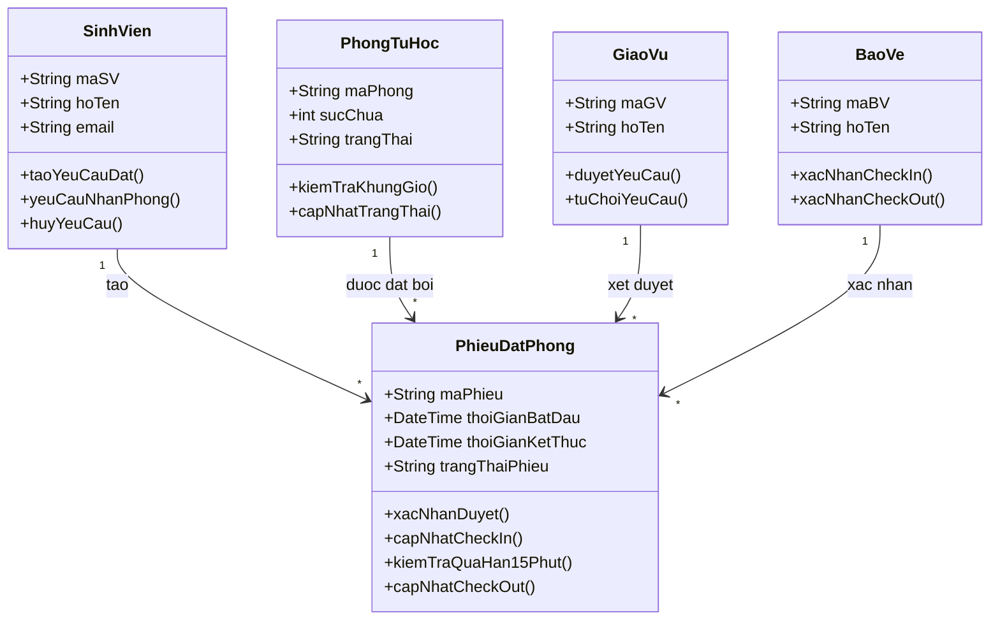

# Sơ đồ lớp — Hệ thống Đặt chỗ Phòng tự học

*Hiển thị trực quan cho GitHub render từ tệp `diagrams/class.mmd`.*

```mermaid
classDiagram
  class SinhVien {
    +String maSV
    +String hoTen
    +String email
    +taoYeuCauDat()
    +yeuCauNhanPhong()
    +huyYeuCau()
  }
  class PhongTuHoc {
    +String maPhong
    +int sucChua
    +String trangThai
    +kiemTraKhungGio()
    +capNhatTrangThai()
  }
  class GiaoVu {
    +String maGV
    +String hoTen
    +duyetYeuCau()
    +tuChoiYeuCau()
  }
  class BaoVe {
    +String maBV
    +String hoTen
    +xacNhanCheckIn()
    +xacNhanCheckOut()
  }
  class PhieuDatPhong {
    +String maPhieu
    +DateTime thoiGianBatDau
    +DateTime thoiGianKetThuc
    +String trangThaiPhieu
    +xacNhanDuyet()
    +capNhatCheckIn()
    +kiemTraQuaHan15Phut()
    +capNhatCheckOut()
  }

  SinhVien "1" --> "*" PhieuDatPhong : tao
  PhongTuHoc "1" --> "*" PhieuDatPhong : duoc dat boi
  GiaoVu "1" --> "*" PhieuDatPhong : xet duyet
  BaoVe "1" --> "*" PhieuDatPhong : xac nhan
```
